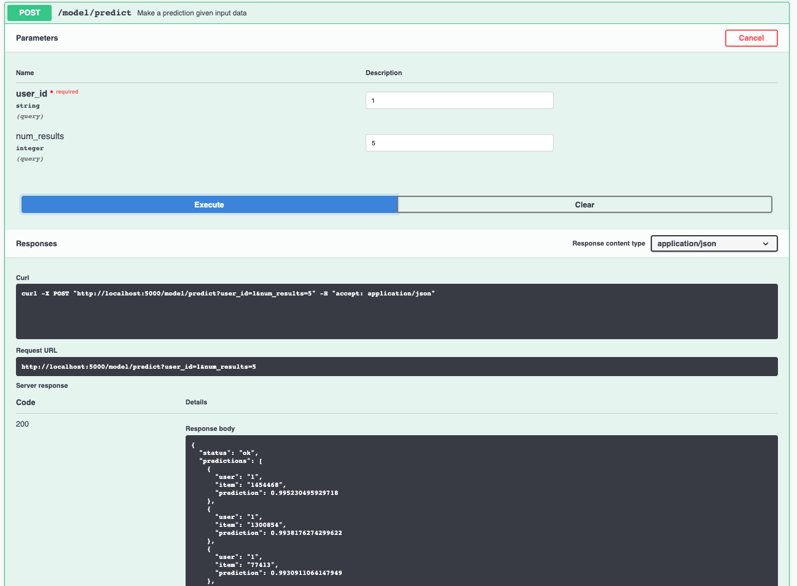

[](https://travis-ci.com/IBM/MAX-Recommender) [](http://max-recommender.codait-prod-41208c73af8fca213512856c7a09db52-0000.us-east.containers.appdomain.cloud/)

[](http://ibm.biz/max-to-ibm-cloud-tutorial)

# IBM Developer Model Asset Exchange: MAX Recommender

This repository contains code to instantiate and deploy a recommender model.
This model can be trained on a dataset containing users, items, ratings, and timestamps and make personalized item recommendations for a given user. Once trained, the input to the model is a user IDs and the output is a list of recommended item IDs sorted by probability in descending order. For demo purposes this model has been trained on a subset of the [MovieTweetings Dataset](https://github.com/sidooms/MovieTweetings), containing 457 users with their IDs mapped from 0 to 457 for convenience.

The model is based on the [Neural Collaborative Filtering model]([https://github.com/microsoft/recommenders]). The model files are hosted on
[IBM Cloud Object Storage](https://max-cdn.cdn.appdomain.cloud/max-recommender/1.0.0/assets.tar.gz).
The code in this repository deploys the model as a web service in a Docker container. This repository was developed
as part of the [IBM Developer Model Asset Exchange](https://developer.ibm.com/exchanges/models/) and the public API is powered by [IBM Cloud](https://ibm.biz/Bdz2XM).

## Model Metadata
| Domain | Application | Industry  | Framework | Training Data | Input Data Format |
| ------------- | --------  | -------- | --------- | --------- | -------------- | 
| Information Retrieval | Recommendations | Commerce | TensorFlow | [MovieTweetings](https://github.com/sidooms/MovieTweetings) | CSV |

## References


* _X. He, L. Liao, H. Zhang, L. Nie, X. Hu, T. Chua_, ["Neural Collaborative Filtering"](https://arxiv.org/abs/1708.05031), WWW 2017.
* [Microsoft Recommender Systems GitHub Repo](https://github.com/microsoft/recommenders)

## Licenses

| Component | License | Link  |
| ------------- | --------  | -------- |
| This repository | [Apache 2.0](https://www.apache.org/licenses/LICENSE-2.0) | [LICENSE](LICENSE) |
| Model Weights | [Apache 2.0](https://www.apache.org/licenses/LICENSE-2.0) | [LICENSE](LICENSE) |
| Model Code (3rd party) | [MIT](https://opensource.org/licenses/mit-license.html) | [Microsoft Recommender Systems GitHub Repo](https://github.com/microsoft/recommenders/blob/master/LICENSE) |

## Pre-requisites:

* `docker`: The [Docker](https://www.docker.com/) command-line interface. Follow the [installation instructions](https://docs.docker.com/install/) for your system.
* The minimum recommended resources for this model is 4GB Memory and 2 CPUs.

# Steps

1. [Deploy from Docker Hub](#deploy-from-docker-hub)
2. [Deploy on Kubernetes](#deploy-on-kubernetes)
3. [Deploy on Red Hat OpenShift](#deploy-on-red-hat-openshift)
4. [Run Locally](#run-locally)

## Deploy from Docker Hub

To run the docker image, which automatically starts the model serving API, run:

```
$ docker run -it -p 5000:5000 codait/max-recommender
```

This will pull a pre-built image from Docker Hub (or use an existing image if already cached locally) and run it.
If you'd rather checkout and build the model locally you can follow the [run locally](#run-locally) steps below.

## Deploy on Kubernetes

You can also deploy the model on Kubernetes using the latest docker image on Docker Hub.

On your Kubernetes cluster, run the following commands:

```
$ kubectl apply -f https://github.com/IBM/MAX-Recommender/raw/master/max-recommender.yaml
```

The model will be available internally at port `5000`, but can also be accessed externally through the `NodePort`.

A more elaborate tutorial on how to deploy this MAX model to production on [IBM Cloud](https://ibm.biz/Bdz2XM) can be found [here](http://ibm.biz/max-to-ibm-cloud-tutorial).

## Deploy on Red Hat OpenShift:

  Follow the instructions for the OpenShift web console or the OpenShift Container Platform CLI in [this tutorial](https://developer.ibm.com/tutorials/deploy-a-model-asset-exchange-microservice-on-red-hat-openshift/) and specify `codait/max-recommender` as the image name.

## Run Locally

1. [Build the Model](#1-build-the-model)
2. [Deploy the Model](#2-deploy-the-model)
3. [Use the Model](#3-use-the-model)
4. [Development](#4-development)
5. [Cleanup](#5-cleanup)


### 1. Build the Model

Clone this repository locally. In a terminal, run the following command:

```
$ git clone https://github.com/IBM/MAX-Recommender.git
```

Change directory into the repository base folder:

```
$ cd MAX-Recommender
```

To build the docker image locally, run: 

```
$ docker build -t max-recommender .
```

All required model assets will be downloaded during the build process. _Note_ that currently this docker image is CPU only (we will add support for GPU images later).


### 2. Deploy the Model

To run the docker image, which automatically starts the model serving API, run:

```
$ docker run -it -p 5000:5000 max-recommender
```

### 3. Use the Model

The API server automatically generates an interactive Swagger documentation page. Go to `http://localhost:5000` to load it. From there you can explore the API and also create test requests.

User the `model/predict` endpoint to retrieve recommendations for a user ID. The number of predictions returned can be specified with `num_results`, by default the model returns 5 predictions.




You can also test it on the command line, for example:

```
$ curl -X POST "http://localhost:5000/model/predict?user_id=1&num_results=5" -H "accept: application/json"
```

You should see a JSON response like that below:

```json
{
  "status": "ok",
  "predictions": [
      {
      "user": "1",
      "item": "1454468",
      "prediction": 0.995230495929718
    },
    {
      "user": "1",
      "item": "1300854",
      "prediction": 0.9938176274299622
    },
    {
      "user": "1",
      "item": "77413",
      "prediction": 0.9930911064147949
    },
    {
      "user": "1",
      "item": "1731141",
      "prediction": 0.9929673671722412
    },
    {
      "user": "1",
      "item": "363226",
      "prediction": 0.9914621710777283
    }
  ]
}
```

### 4. Development

To run the Flask API app in debug mode, edit `config.py` to set `DEBUG = True` under the application settings. You will then need to rebuild the docker image (see [step 1](#1-build-the-model)).

### 5. Cleanup

To stop the Docker container, type `CTRL` + `C` in your terminal.

## Train this Model on Watson Machine Learning

This model supports both fine-tuning with transfer learning and training from scratch on a custom dataset. Please follow the steps listed under the [training readme](training/README.md) to retrain the model on [Watson Machine Learning](https://www.ibm.com/cloud/machine-learning), a deep learning as a service offering of [IBM Cloud](https://ibm.biz/Bdz2XM).
